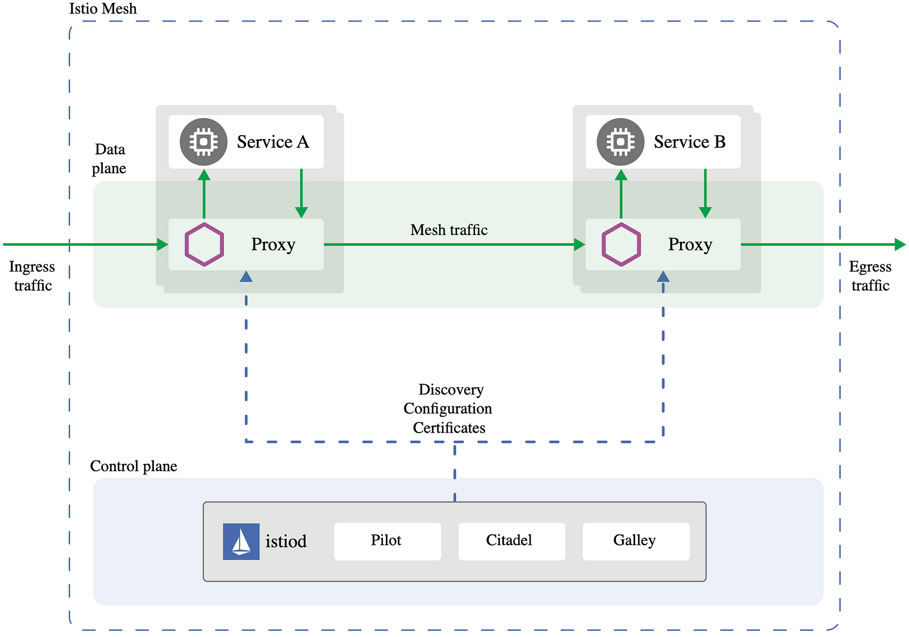

# Part 3: Understanding Istio's Architecture

---

This is the third article in our Istio Service Mesh series. In the previous blog post, we explored the key components of Istio such as istiod, the Ingress Gateway, and the Envoy sidecar model. Now, we'll go a level deeper and cover Istio's modular architecture.

Istio's modular architecture is one of its biggest strengths, but truly mastering it means understanding how the pieces fit together not just by name, but by behavior. In this article, we'll break down the layers and supporting concepts that tie the mesh together and set the stage for advanced usage.

---

## Control Plane vs. Data Plane: Understanding the Layers of Istio
At the heart of Istio is a clear separation of responsibilities between the control plane and the data plane. Understanding this boundary is key to mastering the service mesh model. The components were discussed deeply in the previous articles, and now we will see how they interact with each other and what the responsibilities of each one are.

### Istiod The Control Plane Configuration and Coordination
It doesn't touch actual traffic, but is responsible for:
- Watching the Kubernetes API for changes (services, pods, endpoints, CRDs)
- Maintaining an internal model of the mesh
- Distributing configurations, security policies, and certificates
- Pushing updates to all proxies via the xDS API

Think of the control plane as the central brain of Istio.

### The Data Plane Actual Traffic Flow
This is where the action happens the network layer.
It consists of:
- Envoy sidecar proxies: Injected into each pod to intercept and manage inbound/outbound traffic
- Istio Ingress Gateway: A standalone Envoy proxy that handles all inbound traffic into the mesh

The data plane enforces what the control plane decides. It applies routing rules, security policies, retries, telemetry collection, and more without touching your app code.

### How They Work Together
Istio's control plane and data plane work dynamically and in concert to manage service mesh traffic:
- Istiod (Control Plane) watches for changes in configuration and policies, then pushes updates to all relevant proxies in the mesh.
- Ingress Gateway (Data Plane) enforces these policies on traffic entering the mesh from outside.
- Envoy Sidecar Proxies (Data Plane) enforce the same policies for traffic flowing between services inside the mesh in real time.

In essence, the control plane defines and distributes configuration, while the data plane proxies actively enforce the desired behavior as traffic moves through the mesh.

> This diagram shows how Istio separates the control plane from the data plane. istiod manages configuration and service discovery, while Envoy sidecars enforce routing, security, and telemetry inside the mesh. Think of the control plane as mission control, constantly monitoring and issuing updated instructions, while the data plane is the execution engine that applies those instructions to every network request.    

*Figure: Istio mesh architecture showing control plane and data plane separation, with istiod, Pilot, Citadel, and Galley managing proxies for services.*

---

## How Auto Sidecar Injection Works
Istio simplifies the process of adding Envoy sidecar proxies to your application pods through automatic sidecar injection. This is achieved using Kubernetes admission webhooks, which act like gatekeepers during pod creation.

### What Is an Admission Webhook?
In Kubernetes, an admission webhook is a special HTTP callback that the Kubernetes API server calls during the lifecycle of an object, like a Pod. There are two types:
- Validating Admission Webhook: Checks if the object meets certain criteria but doesn't change it.
- Mutating Admission Webhook: Can modify the object before it's persisted.

Istio leverages a mutating admission webhook to automatically inject the Envoy sidecar proxy into your pods.

#### Here's how it works
1. You label a namespace or a specific deployment to enable sidecar injection.
2. When Kubernetes starts creating a pod in that labeled scope, it sends the pod specification to Istio's admission webhook before the pod actually runs.
3. The webhook modifies (mutates) the pod specification on the fly, injecting the Envoy sidecar container alongside your application container(s).
4. The pod is then created with both your application and the Envoy sidecar running together, fully integrated into the service mesh.

Because this happens automatically and transparently during pod creation, you don't need to manually change your deployment YAMLs or container images. Your application pods become part of the mesh seamlessly, enabling Istio's traffic management, security, and telemetry features right out of the box.

#### Why Use Admission Webhooks?
- **Automatic:** You don't have to manually modify your deployment manifests.
- **Transparent:** The injection happens behind the scenes without changing your app code or images.
- **Consistent:** Ensures every pod in the labeled namespace follows the same mesh configuration.

---

## What Istio Does Not Do
While Istio is powerful, it's not responsible for everything:
- It doesn't collect, store, or visualize telemetry data: it only configures proxies to emit metrics, logs, and traces. Tools like Prometheus, Grafana, Jaeger, and Kiali are typically used alongside Istio for observability.
- It doesn't provide a user interface or dashboard: for visualizing service graphs or traffic flow, you'll need tools like Kiali.
- It doesn't manage or enforce global cluster policies: Istio focuses on service-to-service communication within the mesh, not on broader platform or security governance.
- It doesn't secure your application code or data: Istio provides transport-level security between services (mTLS), but it doesn't handle application-layer logic or data encryption at rest.

Understanding these boundaries helps avoid common misconceptions and lets you integrate Istio more effectively within a larger cloud-native stack.

---

## A Glimpse at the Gateway API
Kubernetes has introduced the Gateway API, a new way to express traffic routing and ingress behavior using more standardized CRDs. Istio supports the Gateway API alongside its own resources, and it's expected to become more prominent over time.
While we're not diving into it now, it's worth watching if you're planning a long-term platform around Kubernetes-native tooling.

---

## What's Next?
Now that you've seen how Istio's control and data planes work together and what's under the hood it's time to start getting hands-on with traffic management.
We will build on the foundation we've just laid and create a local Kubernetes cluster running via k3d with a sample NGINX app routed by Istio. This environment will serve as the starting point for all future hands-on blog posts.

*Stay tuned things are about to get even more interesting!*
